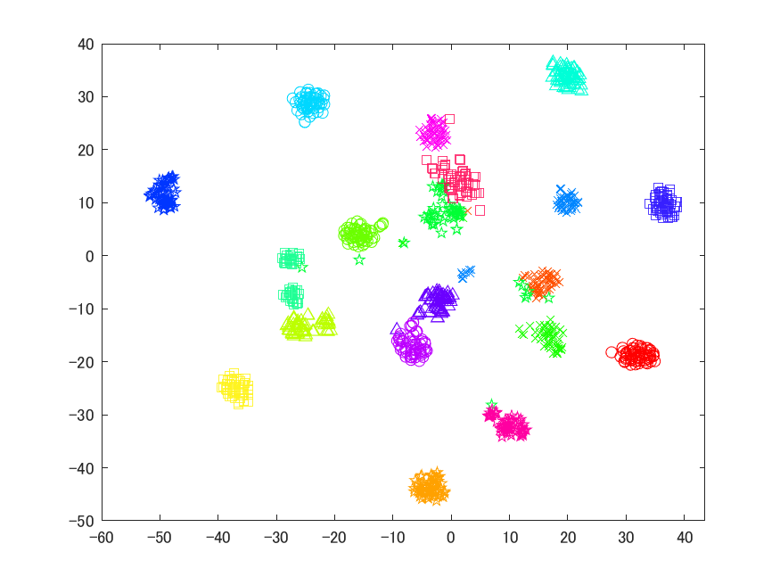

The Matlab implementation of our algorithm presented in the IJCNN'19 paper titled "Learning with Coherence Patterns in Multivariate Time-series Data via Dynamic Mode Decomposition".

We abbreviate Support Vector Machine as SVM, Dynamic Mode Decomposition as DMD, 
Principal Component Analisys as PCA, t-distributed Stochastic Neighbor Embedding as tSNE, respectively.

## Data
Data used in the paper is UCI Daily and Sports Activities Data Set.

The data set contains 8 person's 19 activities.

For more details, see the original web page below.

https://archive.ics.uci.edu/ml/datasets/daily+and+sports+activities

After downloading the data, run make_data.m in the downloaded folder and put the outputs into ./data.

## Library
We use the well-known SVM library LIBSVM.

Download it from the web page below and replace ./libsvm-3.23 with the downloaded one.

https://www.csie.ntu.edu.tw/~cjlin/libsvm/.

## Description
svm_DMD.m, svm_SDMD.m and svm_PCA.m perform classification via SVM.

The input of SVM is the distance matrix of data.

The distance matrices in those files are computed by DMD modes, Supervised PCA + DMD modes, and PCA modes, respectively.

tSNE_DMD.m, tSNE_SDMD.m and tSNE_PCA.m perform visualization of the feature vectors above via tSNE.

## Example
Result of svm_SDMD.m is below.

Result of tSNE_SDMD.m is below.

## Licence
This sorce code is released under the MIT Licence, see LICENSE.

## References
T.Bito, M.Hiraoka, Y.Kawahara, "Learning with Coherence Patterns in Multivariate Time-series Data via Dynamic Mode Decomposition," 
in *Proc.* of The International Joint Conference on Neural Networks 2019(IJCNN2019), 2019, pp. xx-xx.

(URL of the paper is comming soon)

LIBSVM -- A Library for Support Vector Machine

https://www.csie.ntu.edu.tw/~cjlin/libsvm/

UCI Machine Learning Repository 

Daily and Sports Activities Data Set.

https://archive.ics.uci.edu/ml/datasets/daily+and+sports+activities
